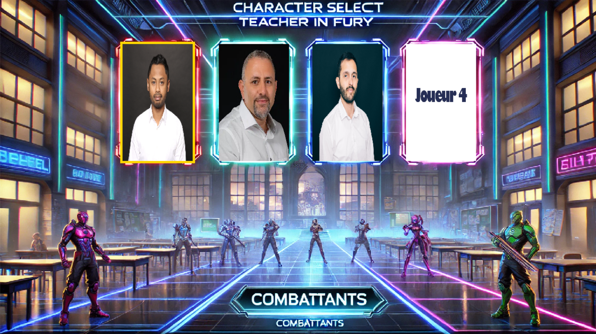
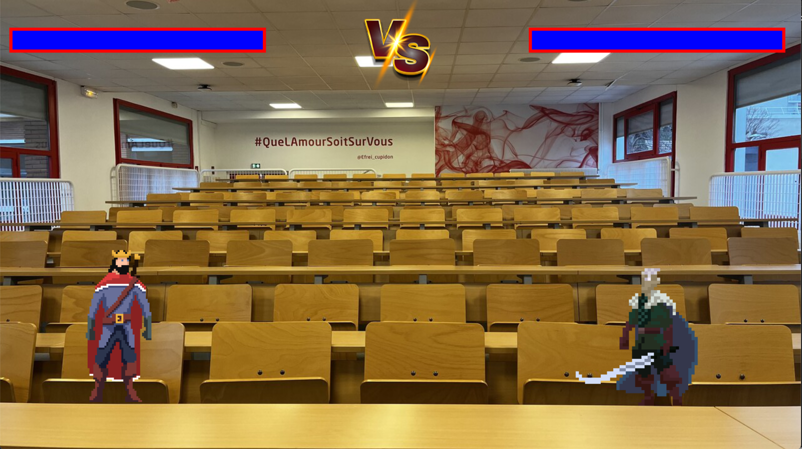

# **💥 EFREI BRAWL 💥**

## **Présentation du projet**
Ce projet est un jeu de combat 2D développé avec **Pygame**. 🎮 Deux joueurs s'affrontent dans une arène avec des personnages ayant des attaques et des mouvements spécifiques. Chaque joueur choisit un personnage et lutte pour atteindre la victoire en remportant un maximum de rounds. 🏆

Le jeu dispose de plusieurs personnages avec des animations et des effets sonores. 🔊

Nos enseignants sont les combattants ! Avec leurs accords, ils font place dans la terrible arène : **L'amphi E003** ⚔️🔥

## **Table des matières**
- [📥 Installation](#installation)
- [🎮 Fonctionnalités](#fonctionnalités)
- [🎮 Commandes](#commandes)
- [📸 Quelques images](#screenshots)
- [👨‍💻 Auteurs](#auteurs)
- [📜 Licence](#licence)

## **📥 Installation**
Voici les étapes pour installer et exécuter le jeu sur votre machine :

### 1. 🚀 Cloner le projet
Clonez le projet depuis GitHub en utilisant la commande suivante :
```bash
git clone https://github.com/ElpharienPY/EFREI_Brawl_.git
```

### 2. 📦 Installer les dépendances
Ce jeu utilise Pygame et OpenCV. Pour installer les dépendances nécessaires, exécutez les commandes suivantes :
```bash
pip install pygame opencv-python
```

### 3. 📂 Structure du projet
Le projet est organisé de la manière suivante :
```bash
.
├── assets/                # Contient les images, sons et vidéos 🎨🎶
│   ├── images/            # Les images de personnages, arène, interface, etc.
│   ├── sounds/            # Musiques et effets sonores 🔊
│   └── vidéos/            # Vidéos d'introduction des personnages 🎥
├── player.py              # Gère le comportement des personnages 👾
├── game.py                # Gestion du gameplay 🎮
├── menu.py                # Gestion de l'interface du menu principal 🏠
├── main.py                # Fichier principal pour exécuter le jeu ▶️
└── README.md              # Ce fichier 📖
```

### 4. 🎯 Lancer le jeu
Une fois les dépendances installées, vous pouvez démarrer le jeu en exécutant le fichier principal :
```bash
python main.py
```

## **🎮 Fonctionnalités**
- **🔹 Sélection des personnages** : Les joueurs peuvent choisir parmi une liste de personnages avec des animations spécifiques.
- **🔹 Modes de jeu** : Le jeu supporte un mode 1v1 avec des rounds et une gestion du score. 🏆
- **🔹 Animations et effets** : Chaque personnage dispose de son propre jeu d'animations pour les attaques, les sauts et autres actions. Des effets sonores sont également associés. 🎭
- **🔹 Vidéos d'introduction** : Chaque personnage a une vidéo d'introduction avant le début de la partie. 🎬
- **🔹 Interface graphique** : Un menu principal pour la sélection des joueurs et des personnages. 🖥️

### 1️⃣ Sélection des Personnages ✨
Chaque joueur peut choisir parmi les quatre personnages disponibles, chacun ayant ses propres caractéristiques et compétences spéciales. ⚡

### 2️⃣ Combat ⚔️🔥
Le gameplay se déroule dans une arène où les joueurs s'affrontent en utilisant des attaques de mêlée et des compétences spéciales. Des effets sonores et des animations rendent chaque attaque plus immersive. 💥

### 3️⃣ Musique et Effets Sonores 🎶
Des morceaux de musique sont joués en fond sonore pendant le combat, et chaque attaque est accompagnée d'effets sonores pour augmenter l'immersion. 🎧

## **🎮 Commandes**
Voici les commandes que vous pouvez utiliser dans le jeu :

- **⏹️ Échap (ESC)** : Quitter le jeu à tout moment.
- **⬅️➡️ Flèche droite / Flèche gauche** : Naviguer dans les options de sélection des personnages.
- **⏭️ Entrée (Enter)** : Valider le choix du personnage.
- **1️⃣ / 2️⃣** : Sélectionner les personnages pour les joueurs 1 et 2.

### **👤 Joueur 1**
- **Z, Q, S, D** : Pour se déplacer 🚶‍♂️
- **E, R** : Pour attaquer 🥊

### **👤 Joueur 2**
- **⬆️⬇️⬅️➡️** : Pour se déplacer 🚶‍♂️
- **num1, num2** : Pour attaquer 🥊

## **📸 Screenshots**
Voici quelques captures d'écran du jeu pour vous donner un aperçu de l'interface et du gameplay :


*Écran de sélection des personnages*


*Exemple d'un combat en cours*

## **👨‍💻 Auteurs**
- **Raphael Gastaldo** 🏆
- **Alexandre Johannel** 🎭
- **Iwan Hosny** 🔥
- **Youssef Bramli** 🎮

## **📜 Licence**
Ce projet est sous la licence MIT. 📄

🔥 Libre à vous d'y jouer ! Amusez-vous bien ! 🎮✨
