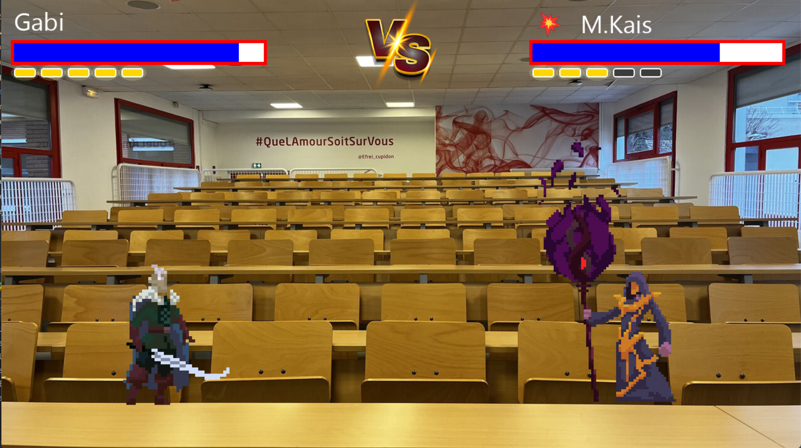

# **💥 EFREI BRAWL 💥**

## **Project Overview**
This project is a 2D fighting game developed with **Pygame**. 🎮 Two players compete in an arena using characters with unique attacks and moves. Each player selects a character and fights to win the most rounds. 🏆

The game includes several characters with animations and sound effects. 🔊

Our teachers are the fighters! With their permission, they enter the dreadful arena: **The E003 Lecture Hall** ⚔️🔥

## **Table of Contents**
- [📥 Installation](#installation)
- [🎮 Features](#features)
- [🎮 Controls](#controls)
- [📸 Screenshots](#screenshots)
- [👨‍💻 Authors](#authors)
- [📜 License](#license)

## **📥 Installation**
Here are the steps to install and run the game on your machine:

### 1. 🚀 Clone the Project
Clone the project from GitHub using the following command:
```bash
git clone https://github.com/ElpharienPY/EFREI_Brawl_.git
```

### 2. 📦 Install Dependencies
This game uses Pygame and OpenCV. Install them with:
```bash
pip install pygame opencv-python
```

### 3. 📂 Project Structure
```bash
.
├── assets/                # Contains images, sounds, and videos 🎨🎶
│   ├── images/            # Character, arena, interface images
│   ├── sounds/            # Music and sound effects 🔊
│   └── videos/            # Character intro videos 🎥
├── player.py              # Handles character behavior 👾
├── game.py                # Manages gameplay 🎮
├── menu.py                # Main menu interface 🏠
├── main.py                # Main file to run the game ▶️
└── README.md              # This file 📖
```

### 4. 🎯 Run the Game
Once installed, you can launch the game by running:
```bash
python main.py
```

## **🎮 Features**
- **🔹 Character selection**: Players can choose from a list of characters with specific animations.
- **🔹 Game modes**: 1v1 mode with rounds and score tracking. 🏆
- **🔹 Animations and effects**: Each character has attack, jump, and action animations with sound effects. 🎭
- **🔹 Intro videos**: Every character has an intro video before the match. 🎬
- **🔹 Graphical interface**: A main menu for player and character selection. 🖥️

### 1️⃣ Character Selection ✨
Each player can choose from four available characters, each with unique attributes and ultimate abilities. ⚡

## 🧩 Available Characters

| Name       | Type     | Ultimate Attack     |
|------------|----------|---------------------|
| M.Rado     | Boxer    | Fire Explosion      |
| M.Chahine  | King     | Royal Beam          |
| Gabi       | Knight   | Thunder             |
| M.Kais     | Wizard   | Fireball            |

### 2️⃣ Combat ⚔️🔥
The gameplay takes place in an arena where players fight using melee and special attacks. Sound effects and animations make every hit more immersive. 💥

### 3️⃣ Music and Sound Effects 🎶
Music plays during combat and every attack includes sound effects for better immersion. 🎧

## **🎮 Controls**

- **⏹️ Escape (ESC)**: Open pause menu  
  ### 🧩 Pause Menu Options  
  | Resume | Menu | Quit |
  |--------|------|------|

- **⬅️➡️ Left / Right Arrows**: Navigate character selection
- **⏭️ Enter**: Confirm character choice
- **1️⃣ / 2️⃣**: Select characters for players 1 and 2

### **👤 Player 1**
- **Z, Q, S, D**: Move 🚶‍♂️  
- **E, R**: Attack 🥊  
- **2**: Double jump  
- **A**: Ultimate attack  

### **👤 Player 2**
- **Arrow Keys**: Move 🚶‍♂️  
- **Num1, Num2**: Attack 🥊  
- **Right Shift**: Double jump  
- **Num3**: Ultimate attack  

## **📸 Screenshots**
Here are a few screenshots showing the interface and gameplay:

  
*Character selection screen*

  
*Example of an ongoing fight*

## **👨‍💻 Authors**
- **Raphaël Gastaldo** 🏆 
- **Alexandre Johannel** 🎭 
- **Iwan Hosny** 🔥  
- **Youssef Bramli** 🎮

## **📜 License**
This project is licensed under the MIT License. 📄

🔥 Feel free to play! Have fun! 🎮✨
